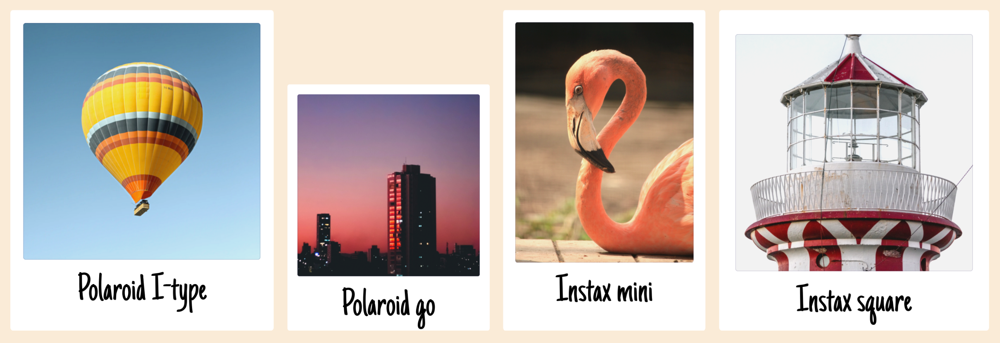

# &lt;instant-picture&gt; Web Component
A Web Component for displaying Polaroid and Instax instant pictures on the web!



***Features***
* A single javascript module file to include
* No dependencies
* No external fetch requests
* Bundled typeface [Just Another Hand](https://fonts.google.com/specimen/Just+Another+Hand)
* Support for the common picture formats `i-type`, `sx-70`, `600`, `go`, `mini`, `square` and `wide`

***Two flavors***
* `~69KB` with bundled typeface 
* `~4.5KB` without bundled typeface

## Example
To load the web component, include a declaration to the javascript module file:

```html
<script type=module src=instant-picture.mjs></script>
```

To use the web component, a declaration as the following will produce a Polaroid i-type picture with text underneath the image:
```html
<instant-picture type=i-type>
    
    <p slot=text>A balloon in the sky!</p>
</instant-picture>
```
Rendering of the `instant-picture`:


## Styling 
To style the web component and its children, following selectors can be used: 

```css
/* Declare styles directly to parent */
instant-picture {
    height: 400px;
    font-size: 48px;
    font-family: 'Comic Sans';
}

/* Target type attribute of instant picture */
instant-picture[type=i-type] { }

/* Target based on if the unstyled attribute is present or not */
instant-picture[unstyled] { }
instant-picture:not([unstyled]) { }

/* Generic targeting of child element representing image */
instant-picture :not([slot=text])) { }

/* Generic targeting of child element representing text */
instant-picture [slot=text] { }
```

## API

Uppercase words defined by [RFC 8174](https://datatracker.ietf.org/doc/html/rfc8174 "Ambiguity of Uppercase vs Lowercase in RFC 2119 Key Words").

### Type attribute

The element `instant-picture` MUST have the attribute `type` with one of the following values:
* `i-type`
* `sx-70`
* `600`
* `go`
* `mini`
* `square`
* `wide`

```html
<instant-picture type=wide></instant-picture>
```
### Unstyled attribute
The element `instant-picture` MAY have the boolean attribute `unstyled` to prevent default styling of the child element representing the image.

```html
<instant-picture type=wide unstyled></instant-picture>
```

### Child elements
The element `instant-picture` SHOULD have a child element representing the image.

The child element of `instant-picture` representing the image, MUST NOT have the attribute `slot` with a non-empty value.

```html
<instant-picture type=go>
    
</instant-picture>
```

The element `instant-picture` MAY have a child element representing the text.

The child element of `instant-picture` representing the text, MUST have the attribute `slot` with the value `text`.

```html
<instant-picture type=go>
    
    <p slot=text>A ballon in the sky!</p>
</instant-picture>
```

It is RECOMMENDED that only one child element represent the image and one child element represent the text.

### Image aspect ratio

The child element representing the image SHOULD have the aspect ratio corresponding to the value of the attribute `type` specified on `instant-picture` as following:
* For `i-type`, `sx-70`, `600`, `go`, `square` aspect ratio 1:1
* For `mini` aspect ratio 1:1.35
* For `wide` aspect ratio 1:0.625

## Licenses
The instant-picture web component is licensed under the [GNU General Public License 3.0](https://www.gnu.org/licenses/gpl-3.0.html).

The typeface [Just Another Hand](https://fonts.google.com/specimen/Just+Another+Hand) is licenced under the [Apache License, Version 2.0.](https://www.apache.org/licenses/LICENSE-2.0)

Licences compability statement from [Apache Software Foundation](https://www.apache.org/licenses/GPL-compatibility.html) and [Free Software Foundation's Licensing and Compliance Lab](https://www.gnu.org/licenses/license-list.html#apache2).